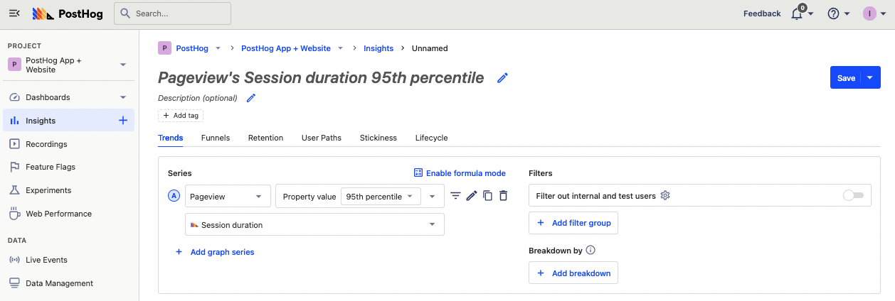
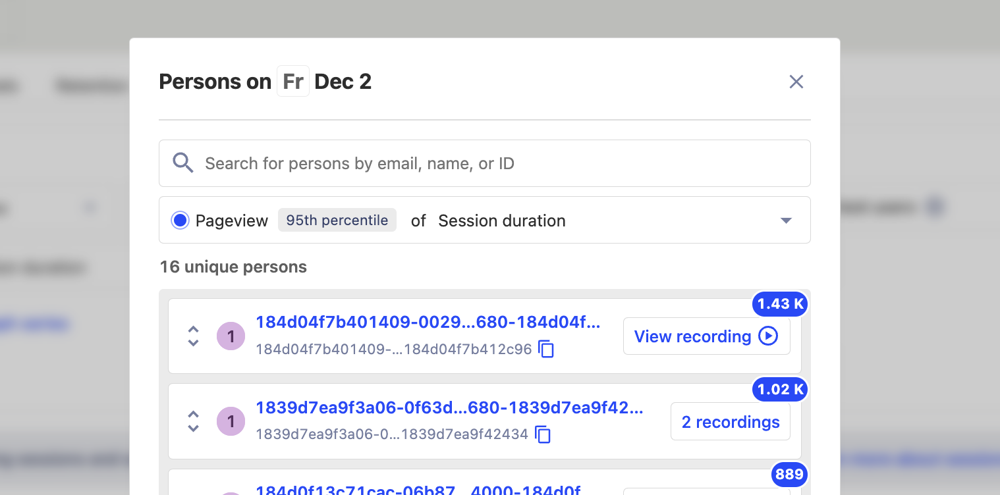
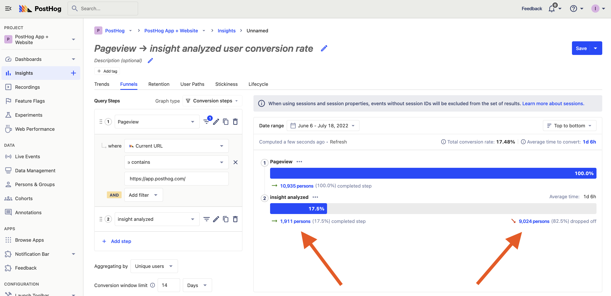
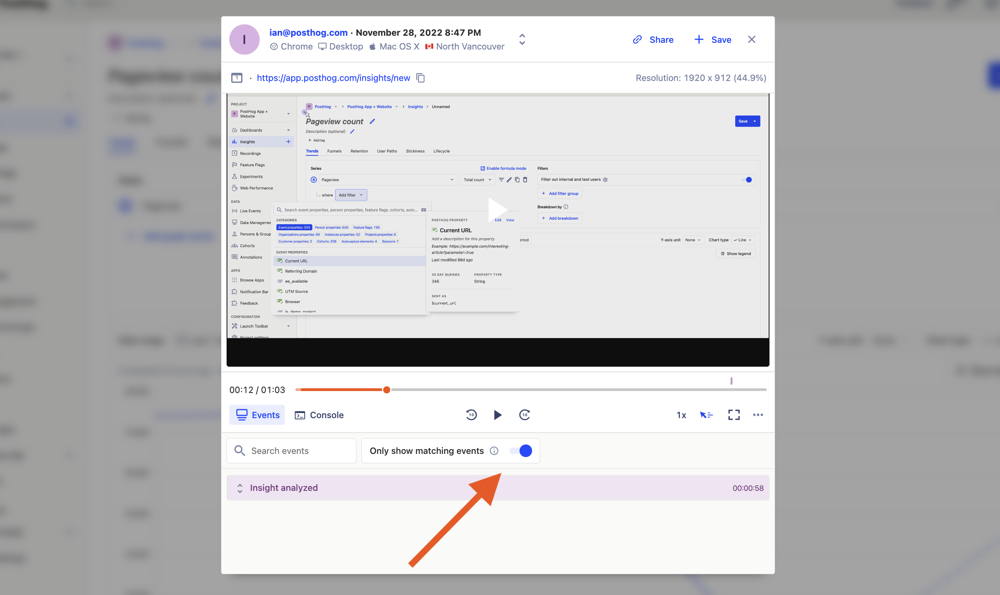
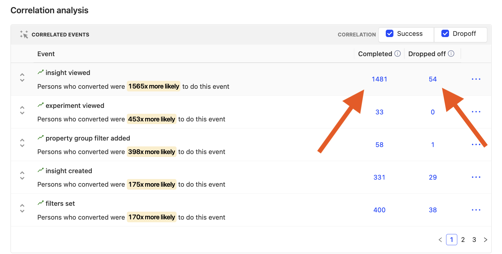
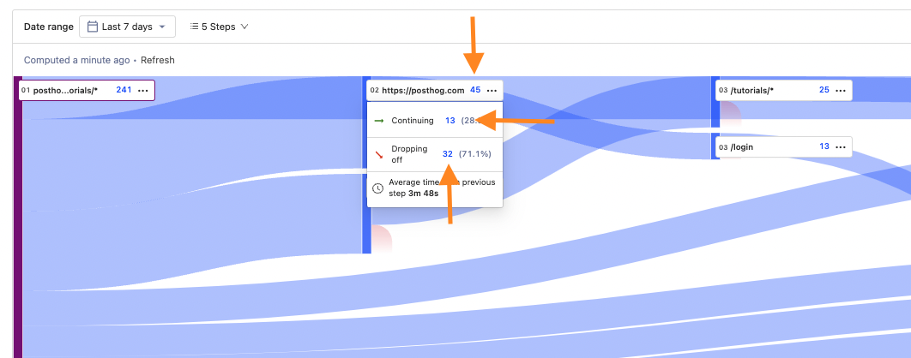

One of the most powerful features of PostHog is all of your product tools and data are in one place. You don’t need to sign up for multiple products, find ways to link them together, have data in different places, and hop between them. In PostHog, going from product data to visualizations to session recordings is literally three clicks.

In this tutorial, we will show the many ways to use session recordings to dive deeper into insights and visualizations you created. Using the connections between tools enables further exploration of user behavior and better, more detailed insights.

> Session recordings require installing the [JavaScript library](https://posthog.com/docs/integrate/client/js) (or [snippet](https://posthog.com/docs/integrate#snippet)) and in “Project settings” under “Recordings.”

## Find and analyze outliers in trend graphs

There are multiple ways to visualize outliers and extreme usage of your product in PostHog. Some of these include trends for: 

- 90th, 95th, 99th percentile, max, or min count per user
- 90th, 95th, 99th percentile, max, or min property value
- extreme filters on events or user properties

When you’ve created a trend with one of these sorting options or filters, you can click the graph to view a list of users and their related session recordings. Viewing the related recordings can help you understand their extreme usage. 

For example, you can create a trend for 95th percentile session duration by creating a series with pageview events, and property value (95th percentile), then make sure to choose “Session duration” under “Sessions” as your property.

Once created, click on any of the days in the graph, and you’ll get a list of people in the 95th percentile of session duration that day. For any of them, click the recording to launch that session and see what they were doing that whole time. 

> **Tip:** If you are watching long session recordings, make sure to enable “Skip inactivity” (the mouse icon on the bottom right of the player). You can also increase the speed of playback using the “1x” button.

## Watching users through funnels

Usually, funnels are aggregate numbers and percentages. When viewing them, it is easy to lose a sense of what is happening in reality. You can combine funnels and session recordings to view both users who succeeded in your funnel and users who have dropped off. Watching session recordings is a good way to reconnect to the reality of what is happening in your funnel.

Once you’ve created a funnel in insights, click on any of the “persons” numbers in the visualization. These are either beside “completed step” or “dropped off.” Clicking on them gives you a list of users and their related sessions. 

When viewing the sessions, you can click the “Only show matching events” button to filter the session’s events by the ones connected to your funnel’s events. It makes it quick to view when in the recording they completed the relevant funnel event.

For example, if you had a signup funnel, you can use a funnel insight to both track the ongoing conversion from pageview to signup, as well as analyze details of where users get stuck in the recording. This should allow you to get an idea of the problem areas in the funnel, as well as specific areas to improve it.

## Watch funnel sessions of correlated events and properties

Correlated events and properties show what correlates to someone completing or dropping off from your funnel. Encouraging or discouraging these events or properties can help improve your funnel. They can also be abstract and disconnected from the real usage of the funnel. Luckily, a list of users and session recordings connect to each of them. 

Once you’ve created a funnel, below the funnel you’ll get a set of correlated events and another for properties. You can click the “Completed” or “Dropped off” numbers on any of them to view a list of users and the related session recording.

> **Tip:** To specifically see success or drop off correlated events or properties, click the selectors in the top right of the component.

Viewing the session recording for a correlated event or property gives a fuller picture of what it means for that correlation to be important. It isn’t just an event or property, but an overall behavior that leads to that different results. 

## Watching journeys from user paths

The user path visualization gives you a collective insight into the paths users are taking throughout your product. They are an aggregate view of how users are moving through your product, but each journey is different. Session recordings enable you to explore individual journeys, and they are connected to every step of the user path visualization.

At every step of the path, you can click the number next to the step, “continuing,” or “dropping off” to view users who viewed that page (or didn’t). From the list, you can go see related recordings. 

In a recording, you can see the specifics of their journey, including the parts relevant to the path. Use the “Only show matching events” button to filter for events related to the stage of the path you clicked.

## Further reading

- [How to build, analyze and optimize conversion funnels](https://posthog.com/tutorials/funnels)
- [How to find relevant session recordings quickly](https://posthog.com/tutorials/filter-session-recordings)